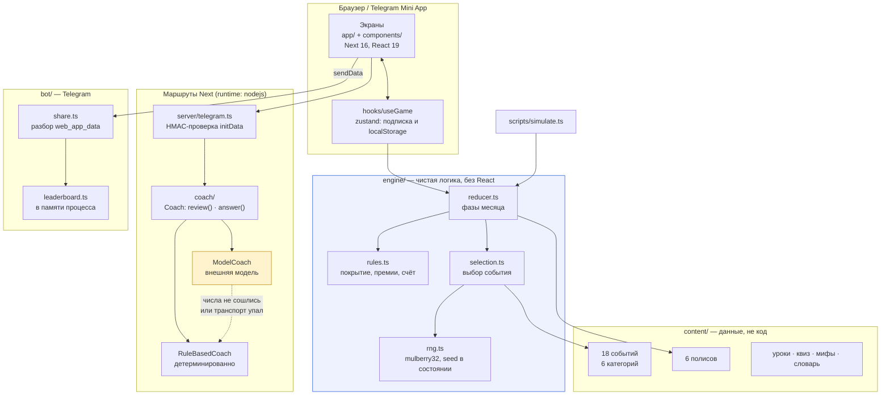
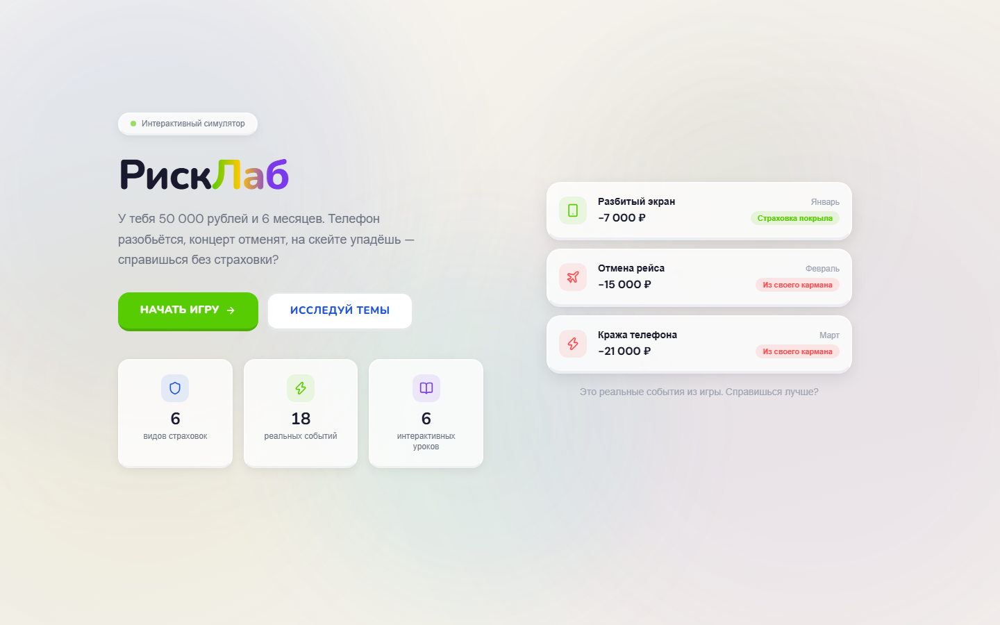
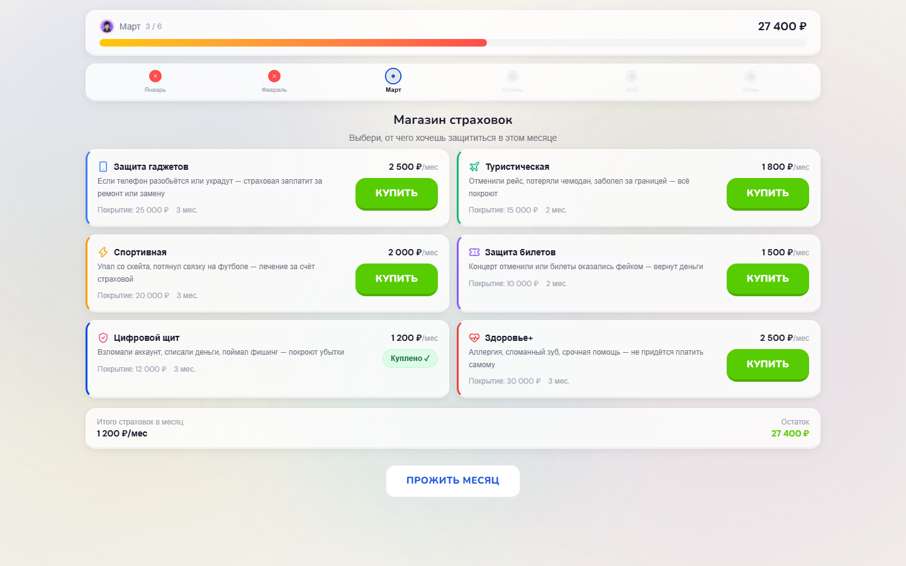
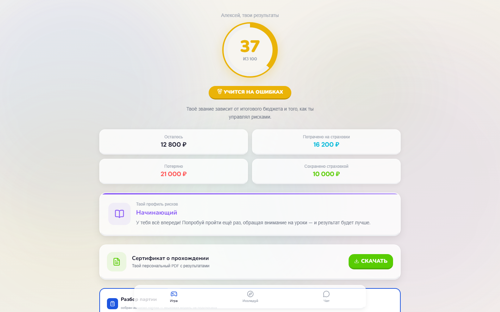
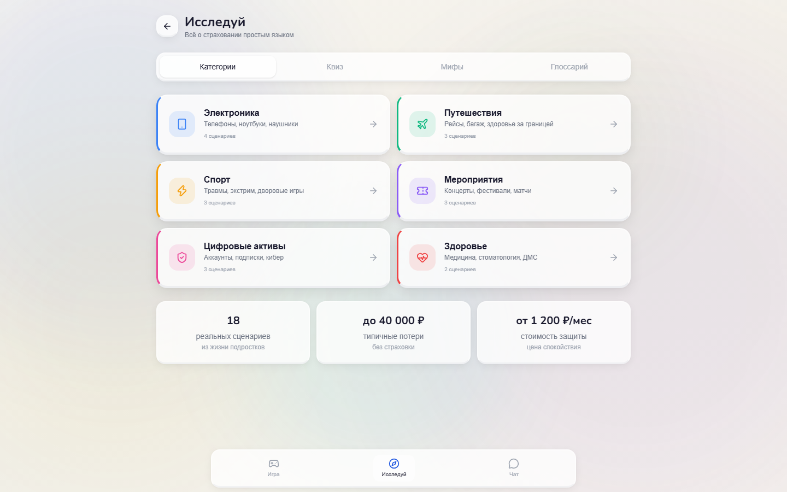
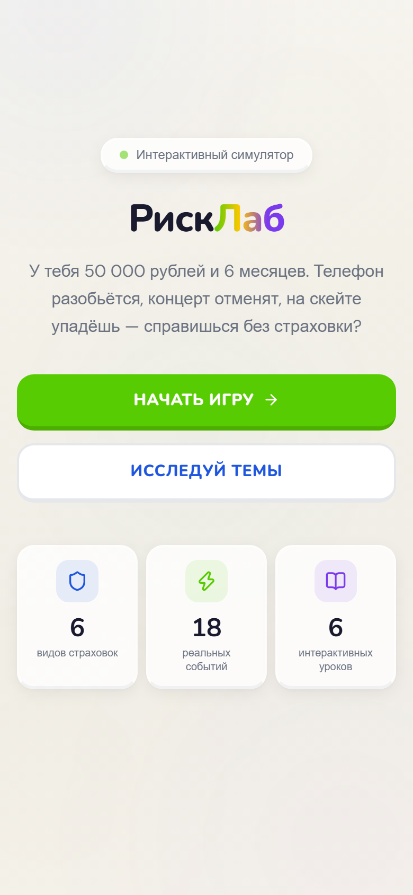
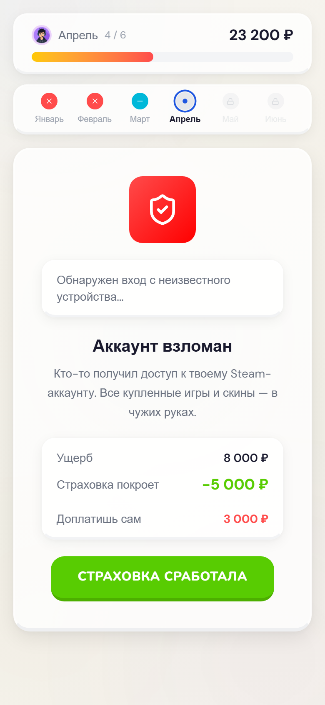
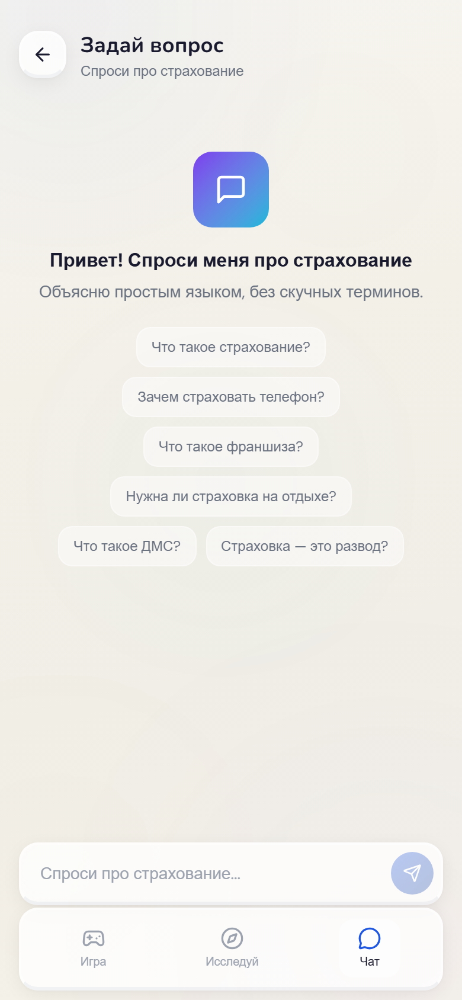

# insurance-sim — РискЛаб

Симулятор, в котором подросток проживает полгода с бюджетом 50 000 ₽ и каждый месяц
решает, какой риск закрыть полисом, — а потом видит в рублях, чего это решение стоило.

Кейс страховой компании на **IT Purple Hack 2026, первое место**. Командный проект;
что именно сделано в этом репозитории поверх хакатонной версии — в разделе
[Что здесь чьё](#что-здесь-чьё).

---

## Задача

Страхование объясняют подростку словами, которых он не проверит на опыте: «премия»,
«возмещение», «франшиза». Проблема не в том, что термины сложные, — в том, что за
ними не стоит ничего, что он уже пережил. Лекция про управление рисками ничем не
отличается от лекции про что угодно ещё.

Симулятор меняет способ доставки. Ты не читаешь про то, что полис на гаджет стоит
2 500 ₽ в месяц и покрывает 25 000 ₽, — ты платишь эти 2 500 из бюджета, из которого
потом не хватит на туристический полис, а через месяц роняешь телефон на асфальт.
Урок держится не на определении, а на том, что деньги видно.

Отсюда три требования, которые определили всё остальное:

1. **Событие должно быть неожиданным, но не произвольным.** Если беда выпадает
   случайно, игрок объясняет результат невезением, а не своим выбором. Если она
   предсказуема — выбора нет вовсе.
2. **Полис должен быть недостаточным.** Шесть категорий и бюджет, которого хватает
   на две-три, — это и есть содержание урока. Возможность купить всё убила бы его.
3. **Числа должны быть настоящими.** Стоимость ремонта экрана, приёма врача за
   границей, восстановления после перелома взяты из открытых источников; ссылки
   собраны в разделе «Разбор» внутри приложения.

---

## Архитектура



Главное в этой схеме — что `engine/` не знает ни про React, ни про сеть. Состояние
партии это данные, переход — чистая функция, а состояние генератора случайных чисел
лежит в самом состоянии (`GameState.seed`). Поэтому одну и ту же партию можно
воспроизвести по одному числу, а `scripts/simulate.ts` играет тысячи партий в цикле
тем же кодом, что и браузер.

Второй узел — ромб под `ModelCoach`. Разбор партии пишет языковая модель, если она
настроена; если нет — тот же разбор собирается из чисел, которые движок уже посчитал.
Оба пути возвращают поле `mode`, и экран показывает, каким из них получен текст.

### Раскладка

```
web/
  src/engine/      1077 строк   правила игры, редьюсер, генератор, счёт
  src/coach/        477         шов «модель или детерминированный разбор»
  src/server/       340         обработчики API и проверка подписи Telegram
  src/content/      773         18 событий, 6 полисов, уроки, квиз, мифы, словарь
  src/components/  4384         30 компонентов интерфейса
  src/app/         1013         6 экранов, 3 маршрута API и глобальные стили
  tests/            517         60 тестов
  scripts/          194         харнесс баланса
bot/
  src/              302         бот, разбор web_app_data, таблица лидеров
  tests/            172         24 теста
```

---

## Решения и компромиссы

### Игра, а не гайд

Первое, что предлагает любой кейс про финансовую грамотность, — объяснить понятнее.
Сделать глоссарий дружелюбнее, добавить примеры, нарисовать инфографику. Это не
работает по той же причине, по которой не работает исходная лекция: подросток не
отказывается понимать слово «франшиза», он не видит, зачем ему это знать сейчас.

Симулятор меняет не подачу, а позицию. Пока ты читаешь, что полис на гаджет стоит
2 500 ₽ и покрывает 25 000 ₽, это два числа. Когда ты платишь 2 500 из бюджета,
которого потом не хватит на туристический полис, а через месяц роняешь телефон, —
это последствие твоего решения. Разница не в понятности, а в том, кому принадлежит
выбор.

Цена решения: игра требует, чтобы правила были честными и проверяемыми, иначе она
превращается в аттракцион с заранее написанным финалом. Отсюда всё остальное в этом
разделе — движок, seed, харнесс баланса. Гайд не потребовал бы ничего из этого.

### Перевес в пользу купленного полиса

Событие выбирается взвешенной лотереей, и категории, которые игрок застраховал,
получают множитель веса 1.5. Приём дидактический: если купленный полис ни разу не
сработал, игрок уходит с выводом «страховка — развод», то есть с противоположным
тому, ради чего всё делалось.

Приём при этом нечестный, и это стоит назвать прямо: игра подыгрывает тому, кто
потратил деньги. Вопрос был не в том, оставлять ли его, а в том, сколько он на самом
деле меняет, — и на это можно ответить измерением, а не спором. Множитель стал
именованным параметром `SelectionRules.insuredWeightBoost`, а харнесс баланса
прогнал одни и те же seed с ним и без него.

Результат — в разделе [«Баланс: измерение»](#баланс-измерение). На краях множитель не
делает ничего: у того, кто не купил ничего, менять нечего, а у того, кто купил всё,
покрытие и так 98.8%. Работает он на типичном игроке с одним-двумя полисами — добавляет
4–6 процентных пунктов покрытия и около 1 000–1 500 ₽ остатка. То есть он смещает
опыт, но не переворачивает исход: стратегия «купить всё» по-прежнему банкротится в
100% партий, и никакой множитель этого не спасает.

Компромисс осознанный: продукт учит, а не моделирует страховой рынок. Но параметр
остался параметром — тот, кто захочет честную лотерею, ставит 1 и видит цену этого
решения в тех же таблицах.

### Чистый редьюсер под неизменным хранилищем

Хакатонная версия держала правила игры внутри действий zustand: каждое действие
читало состояние через `get()`, считало и вызывало `set()`. Событие выбиралось
`Math.random()` прямо в обработчике. Проверить в такой архитектуре нечего — чтобы
узнать, правильно ли списываются премии, нужно открыть браузер и кликать.

Переписано так: состояние партии — данные, переход — чистая функция
`reduce(state, action)`, состояние генератора случайных чисел лежит в самом
состоянии (`GameState.seed`, mulberry32). `useGameStore` при этом остался на месте
и с тем же интерфейсом — ни один компонент не изменился, действие просто отправляет
событие в редьюсер.

Что это дало, кроме тестируемости: партия воспроизводится по одному числу, а
`scripts/simulate.ts` играет тысячи партий тем же кодом, что и браузер. Именно этот
харнесс нашёл ошибку в списании премий и позволил измерить множитель. Снимки в разделе
[«Экраны»](#экраны) сделаны тем же способом — партия доиграна редьюсером до нужной
фазы.

Чего стоило: лишний слой между кликом и состоянием, и дисциплина — любое правило,
написанное в компоненте, ломает всю конструкцию, а компилятор об этом не скажет.
Для игры на шесть месяцев и восемнадцать событий это окупилось; для формы обратной
связи было бы оверинжинирингом.

### Разбор из чисел — реализация, а не запасной вариант

Разбор партии в конце может писать языковая модель. Соблазн — сделать модель
основным путём, а на случай отказа положить заглушку из трёх предложений. Тогда
качество продукта зависит от наличия ключа, и без него продукт хуже.

Сделано наоборот: `RuleBasedCoach` собирает разбор из чисел, которые движок уже
посчитал, и это законченный текст, а не извинение. `ModelCoach` — вторая реализация
того же интерфейса. Оба возвращают поле `mode`, и экран показывает, каким путём
получен текст: подменять один стиль другим молча нельзя, читатель имеет право знать,
кто с ним разговаривает.

Провайдер выбирается явно, через `COACH_PROVIDER`, а не по наличию ключа. Разница
принципиальная: `COACH_PROVIDER=model` без ключа роняет запуск. Опечатка в имени
переменной должна ломать развёртывание, а не тихо менять поведение продукта — иначе
однажды выяснится, что прод три недели отвечал справочником.

### Числа модели проверяются, а не выпрашиваются в промпте

Модель, которой дали цифры партии, охотно называет свои. Просить её в промпте «не
выдумывай суммы» — это надежда, а не механизм.

`ModelCoach` разбирает ответ и сверяет каждую денежную сумму с тем, что посчитал
движок. Не сошлось — ответ отбрасывается целиком и возвращается детерминированный
разбор с `mode: "rules"`. Не потому, что модель плохая, а потому, что продукт учит
обращаться с деньгами: текст, где потрачено 16 200 ₽ вместо 12 800 ₽, хуже, чем
отсутствие текста.

Живой путь к модели в этом репозитории не проверялся — ключа не было. Тестами покрыт
детерминированный путь и `ModelCoach` через подставной транспорт: успех, ошибка сети,
ответ не-200, битый JSON и отдельно — выдуманная сумма в ответе.

### Подпись initData проверяется на сервере

Мини-апп получает от Telegram строку `initData`, подписанную HMAC-ом от токена бота.
Хакатонная версия читала из неё `initDataUnsafe.user` и верила ему. Слово «Unsafe» в
имени поля стоит не случайно: подделать эту строку может кто угодно с `curl`, и в
таблицу лидеров попадёт любой результат от любого имени.

`web/src/server/telegram.ts` проверяет подпись по документированному алгоритму и
дополнительно ограничивает возраст `auth_date` — Telegram подписывает время, но не
ограничивает его срок, так что без окна перехваченная строка работает вечно.
Проверка целиком локальная, ни одного запроса к Bot API, поэтому она полностью
покрыта тестами: подпись строится тем же кодом с любым тестовым токеном.

Компромисс: без `TELEGRAM_BOT_TOKEN` приложение работает как обычный сайт и подпись
не спрашивает. Иначе демо нельзя было бы открыть в браузере. Но если токен задан,
отсутствие заголовка — это отказ, а не проход; на это есть отдельный тест, потому
что именно такую проверку проще всего написать наизнанку.

### Контент — данные, а не код

Восемнадцать событий, шесть полисов, уроки, квиз, мифы и словарь лежат в `content/`
отдельными структурами, а не разбросаны по компонентам. Движок про них ничего не
знает: он работает с весами, суммами и категориями.

Практический предел стоит назвать честно: это всё ещё TypeScript-модули. Редактор
контента, который не разработчик, править их не сможет — нужна сборка, и опечатка в
типе роняет CI. Правильным следующим шагом была бы схема и загрузка из JSON или CMS.
Для шести месяцев и восемнадцати событий это было бы преждевременно, поэтому граница
проведена так: данные отделены от логики, но не от репозитория.

### Что оставлено как есть

**Интерфейс.** Перенесён почти без правок: это законченный дизайн хакатонной
команды, и переписывать его под свой вкус означало бы сделать другой продукт, а не
портировать этот. Добавлен только слой доступности, которого не было. Подробный
список изменений — в разделе [«Что здесь чьё»](#что-здесь-чьё).

**Баланс.** Исправление списания премий сделало страхование дороже на треть-половину:
раньше за трёхмесячный полис бралось две оплаты вместо трёх. Экономика хакатонной
версии подгонялась под эту ошибку, и после починки средний остаток отрицателен у всех
стратегий, а «купить всё» банкротится всегда. Соблазн — подкрутить цены, чтобы
таблицы выглядели приличнее. Не стал: менять экономику продукта — решение авторов
игры, а починка арифметики этого права не даёт. Цифры опубликованы как есть, вместе
с объяснением, что именно в них не так.

**Тёмная тема.** Её нет, и подменой токенов она не делается: фон `body` — жёсткий
градиент, `.glass-panel` построен на белой полупрозрачной плёнке с `backdrop-filter`,
фоновые пятна заданы фиксированными `rgba`. Замена значений даст белые карточки на
тёмном фоне. Это переделка слоя оформления, а не настройка; три конкретные причины
разобраны в [`docs/DESIGN.md`](docs/DESIGN.md).

**Сборка под мессенджер MAX.** Не перенесена: запустить и проверить её я не могу, а
класть в портфолио код, который ни разу не выполнялся, смысла нет.

### Что сделал бы иначе

- **Сервер состояния вместо localStorage.** Сейчас партия не переезжает между
  устройствами, а очистка данных сайта её стирает. Для мини-аппа, который открывают
  и с телефона, и с десктопа, это ощутимо; упирается в то, что аккаунтов в продукте
  нет.
- **Таблица лидеров переживала бы перезапуск.** Она в памяти процесса — об этом
  честно написано в ответе `/leaderboard`, но правильное место для неё Redis или
  таблица в базе.
- **Тёмная тема была бы заложена в токены с самого начала.** Дорого добавлять её
  именно потому, что цвета зашиты в компоненты; переменные стоили бы дешевле, чем
  последующая переделка.
- **Контент уехал бы за схему.** См. выше: JSON плюс валидация вместо
  TypeScript-модулей, чтобы события правил не только разработчики.
- **Проверил бы живой путь к модели.** Подставной транспорт покрывает логику, но не
  отвечает на вопрос, как ведёт себя реальный провайдер под таймаутами и лимитами.

---

## Запуск

Ни одна из этих команд не требует ключей, секретов и сети.

```bash
docker compose up --build        # http://localhost:3000
```

или без Docker:

```bash
make install
make demo                        # сборка + запуск на :3000
```

Проверка, что поднялось:

```bash
$ curl -s localhost:3000/api/health
{"status":"ok","events":18,"quizQuestions":7,"coach":"rules","network":false,"telegramVerification":false}
```

`"coach":"rules"` означает, что разбор собирается детерминированно;
`"network":false` — что в этой конфигурации приложение вообще не создаёт HTTP-клиент
наружу.

### Что включается ключами

| Переменная | Без неё | С ней |
|---|---|---|
| `COACH_PROVIDER=model` + `COACH_API_KEY` | Разбор и ответы в чате собираются из чисел партии и справочника | Их пишет внешняя модель по OpenAI-совместимому протоколу (`COACH_BASE_URL`, `COACH_MODEL`) |
| `TELEGRAM_BOT_TOKEN` | Приложение работает как обычный сайт, подпись не спрашивается | `/api/review` и `/api/coach` требуют заголовок `X-Telegram-Init-Data` и проверяют его HMAC-ом |
| `BOT_TOKEN` + `WEB_APP_URL` | Бот не запускается | `docker compose --profile bot up` поднимает Telegram-бота |

`COACH_PROVIDER=model` без ключа — ошибка запуска, а не тихий откат на
детерминированный разбор. Опечатка в имени переменной должна ронять развёртывание,
а не менять поведение продукта незаметно для того, кто его развернул.

### Разработка

```bash
make check        # lint + typecheck + тесты обоих пакетов
make simulate     # таблицы баланса, GAMES=2000 по умолчанию
```

---

## Баланс: измерение

`npm run simulate` играет партии без интерфейса и печатает то, что на экране не
видно. Ряд seed одинаков для всех стратегий, поэтому сравниваются решения, а не
везение. Ниже — вывод `make simulate GAMES=2000` на этой машине.

Множитель веса для застрахованных категорий равен 1.5: если игрок купил защиту
гаджетов, вероятность именно «разбитого экрана» вырастает в полтора раза.

| стратегия | счёт | остаток | премии | покрыто | потеряно | банкротств | событий в покрытии |
|---|---:|---:|---:|---:|---:|---:|---:|
| без полисов | 4.0 | −207 | 0 | 0 | 50 207 | 51.4% | 0.0% |
| всё подряд | 59.6 | −4 120 | 45 959 | 20 714 | 8 162 | 100.0% | 98.8% |
| самый дешёвый | 14.1 | −1 372 | 6 772 | 3 721 | 44 600 | 56.0% | 19.1% |
| после первой беды | 17.4 | −5 039 | 17 895 | 8 984 | 37 144 | 76.3% | 20.1% |
| два дешёвых | 20.8 | −4 485 | 14 995 | 5 758 | 39 490 | 68.5% | 31.5% |

Тот же прогон с множителем 1 — честная лотерея:

| стратегия | счёт | остаток | премии | покрыто | потеряно | банкротств | событий в покрытии |
|---|---:|---:|---:|---:|---:|---:|---:|
| без полисов | 4.0 | −207 | 0 | 0 | 50 207 | 51.4% | 0.0% |
| всё подряд | 59.5 | −4 132 | 45 956 | 20 609 | 8 177 | 100.0% | 98.5% |
| самый дешёвый | 11.9 | −2 526 | 6 732 | 2 936 | 45 795 | 61.2% | 15.1% |
| после первой беды | 15.9 | −5 555 | 18 176 | 7 051 | 37 378 | 81.5% | 15.9% |
| два дешёвых | 17.9 | −5 984 | 14 704 | 4 577 | 41 280 | 76.8% | 25.6% |

Разница, которую вносит множитель:

| стратегия | Δ счёт | Δ остаток | Δ покрыто | Δ событий в покрытии |
|---|---:|---:|---:|---:|
| без полисов | +0.0 | +0 | +0 | +0.0 п.п. |
| всё подряд | +0.1 | +12 | +105 | +0.3 п.п. |
| самый дешёвый | +2.2 | +1 155 | +785 | +4.0 п.п. |
| после первой беды | +1.5 | +515 | +1 934 | +4.2 п.п. |
| два дешёвых | +2.9 | +1 499 | +1 181 | +5.9 п.п. |

Как это читать. Множитель не трогает края: у того, кто не купил ничего, менять
нечего, а у того, кто купил всё, покрытие и так 98.8%. Работает он ровно на
середине — на игроке с одним-двумя полисами, то есть на самом типичном. Ему
множитель добавляет 4–6 процентных пунктов покрытия и около 1 000–1 500 ₽ остатка.

Отдельно стоит назвать то, что видно в обеих таблицах: **средний остаток
отрицателен у всех стратегий, а «всё подряд» банкротится в 100% партий.**
Последнее не баг, а работающее правило: магазин прямо говорит, что на всё денег не
хватит. А вот 51.4% банкротств у стратегии «не покупать ничего» — свойство контента:
суммарный ущерб восемнадцати событий сопоставим со стартовым бюджетом.

Числа выше получены при исправленном списании премий (см. ниже). Прежняя, ошибочная
схема брала за трёхмесячный полис две оплаты вместо трёх, а за двухмесячный — одну
вместо двух, то есть страхование было на треть-половину дешевле. **Баланс
хакатонной версии подгонялся под эту ошибку, и я его не перенастраивал:** менять
экономику продукта — решение авторов игры, а не того, кто чинит арифметику.

---

## Проверка подписи Telegram

Мини-апп получает от Telegram строку `initData` — query string, подписанный HMAC-ом
от токена бота. Хакатонная версия читала из неё `initDataUnsafe.user` и верила ему;
слово «Unsafe» в имени поля стоит не случайно — подделать эту строку может кто
угодно с `curl`.

`web/src/server/telegram.ts` проверяет подпись по документированному алгоритму:
вынуть `hash`, отсортировать остальные пары, склеить через `\n`, посчитать
`HMAC-SHA256(HMAC-SHA256("WebAppData", токен), строка)` и сравнить. Плюс проверка
возраста `auth_date`, которой в спецификации нет: Telegram подписывает время, но не
ограничивает его срок, и без окна перехваченная строка работает вечно.

Проверка целиком локальная — ни одного запроса к Bot API, — поэтому она полностью
покрыта тестами: подпись строится тем же кодом с любым тестовым токеном, настоящий
не нужен. Тринадцать тестов: валидная строка, подмена поля после подписи, чужой
токен, отсутствие `hash`, просроченный и будущий `auth_date`, `user` без `id`,
`user` не-JSON, и отдельно — что при настроенном токене отсутствие заголовка это
отказ, а не проход.

---

## Бот

`bot/` — Telegram-бот на grammy: `/start` с кнопкой запуска мини-аппа, `/help`,
`/about`, `/leaderboard`, и обработчик `web_app_data`, принимающий результат партии.

Логика вынесена в чистые модули и покрыта 24 тестами без сети и без токена:

- `share.ts` — разбор присланного результата. Telegram подтверждает отправителя, но
  не содержимое: JSON собирает страница на устройстве игрока. Поэтому payload
  проверяется по полям, суммы ограничиваются диапазоном, счёт зажимается в 0…100,
  а заголовок экранируется — он попадает в сообщение с `parse_mode: 'HTML'`.
- `leaderboard.ts` — таблица лидеров с ограничением по размеру и вытеснением
  худшего.
- `config.ts` — чтение окружения; без `BOT_TOKEN` или с `http://` в `WEB_APP_URL`
  процесс падает на старте.

**Сам процесс бота тестами не покрыт и не может быть.** `/start`, отправка сообщений
и long polling требуют настоящего токена и разговора с Bot API; всё, что можно
проверить без них, вынесено в модули выше, а `bot.ts` остался тонкой проводкой.
Проверить бота целиком можно только вручную, с токеном от @BotFather.

Хакатонная версия несла ещё и сборку под мессенджер MAX — второй транспорт поверх
тех же текстов. В этот репозиторий она не перенесена: запустить и проверить её я не
могу, а класть в портфолио код, который никогда не выполнялся, смысла нет.

---

## Что здесь чьё

**Интерфейс — работа хакатонной команды, перенесён намеренно и почти без правок.**
Палитра, кнопки с физическим нажатием, стеклянные карточки, анимированный фон,
30 компонентов и вся русская копия — авторские. Я не переписывал их и не «улучшал»:
это законченный дизайн, и подменять его своим вкусом было бы не портированием, а
другим продуктом.

Что изменено в интерфейсе и почему:

- убраны название страховой компании — заказчика кейса, адрес развёрнутого стенда и
  два хендла ботов;
- добавлен слой доступности, которого не было: `:focus-visible`, реакция на
  `prefers-reduced-motion`, снят запрет масштабирования страницы, проставлены
  `aria-*` там, где у контрола не было доступного имени или состояния. Ни одно
  правило оформления при этом не тронуто;
- три места, где эмодзи стояли вместо иконок, переведены на `lucide-react` —
  тот же набор, что и во всём остальном интерфейсе;
- из `ChatWindow` удалена вторая копия справочника ответов: те же шесть ответов
  лежали и на клиенте, и на сервере, и разошлись бы при первой правке.

**Переписано под этим интерфейсом:** вся игровая логика (`engine/`), шов выбора
между моделью и детерминированным разбором (`coach/`), обработчики API и проверка
подписи Telegram (`server/`), бот и харнесс баланса. Хакатонная версия держала
правила игры внутри действий zustand-хранилища; проверить в них было нечего, потому
что состояние читалось через `get()`, а событие выбиралось через `Math.random()`
прямо в обработчике. Сейчас `useGameStore` остался на месте и с тем же интерфейсом,
но каждое действие отправляет событие в чистый редьюсер.

**Найдено и исправлено в перенесённой логике:**

| Что | Как было | Как стало |
|---|---|---|
| Списание премий | Полис исключался из списка на оплату раньше, чем считалась сумма: трёхмесячный оплачивался дважды, двухмесячный — один раз | `premiumsDueFor()` берёт плату за каждый месяц действия полиса |
| Граница действия полиса | Покрытие проверялось по `expiresAtMonth > currentMonth`, а списание истёкших — по `> nextMonth`; полис последнего месяца то срабатывал, то нет | Одна функция `isActiveIn()` на весь движок |
| Иконки событий | Ключи карты — `trav-`, `sport-`, `health-`, идентификаторы событий — `trv-`, `spr-`, `hlt-`: 8 иконок из 18 молча не находились | Ключи исправлены; тест требует иконку для каждого события |
| Перевес в пользу купленного | Множитель 1.5 для застрахованных категорий был числом внутри функции выбора | Именованный параметр `SelectionRules.insuredWeightBoost`, измерен в обе стороны |

**Не переносилось:** сборка под мессенджер MAX, PDF-сертификат остался как есть,
презентационные материалы и внутренние документы команды.

---

## Известные ограничения

- **Тёмной темы нет.** Подменой токенов её не сделать: фон `body` задан жёстким
  градиентом, `.glass-panel` построен на белой полупрозрачной плёнке с
  `backdrop-filter`, а фоновые пятна заданы фиксированными `rgba`. Замена значений
  оставит белые карточки на тёмном фоне. Подробности и три конкретные причины — в
  [`docs/DESIGN.md`](docs/DESIGN.md).
- **Прогресс живёт в localStorage.** Сервера состояния нет: на другом устройстве
  партия не продолжится, очистка данных сайта стирает её.
- **Таблица лидеров бота хранится в памяти процесса** и очищается при перезапуске.
  Об этом написано прямо в ответе `/leaderboard`.
- **Живой путь к языковой модели не проверялся.** Ключа у меня не было; тестами
  покрыт детерминированный путь, а класс `ModelCoach` — через подставной транспорт
  (успех, ошибка сети, ответ не-200, битый JSON, выдуманная сумма в ответе).
- **Баланс не перенастраивался** после исправления списания премий — см. раздел
  выше.

---

## Экраны

Снято с production-сборки этого репозитория. Игровые экраны получены не кликами:
партия доиграна до нужной фазы тем же редьюсером, что работает в браузере, и её
состояние подставлено в `localStorage` — поэтому числа на снимках сходятся между
собой.

| Главная | Магазин полисов |
|---|---|
|  |  |
| Что предстоит: 50 000 ₽, шесть месяцев, три примера того, чем это кончается | Апрель, остаток 27 400 ₽. Шесть полисов, купить можно два-три |

| Итоги партии | Раздел «Исследуй» |
|---|---|
|  |  |
| Счёт, куда ушли деньги, профиль рисков и разбор партии | Категории, квиз, мифы и словарь — то же содержание вне игры |

Телефон — основная форма: это Telegram Mini App.

| Главная | Происшествие | Чат |
|---|---|---|
|  |  |  |
| Та же страница на 390 px | Полис есть: 8 000 ₽ ущерба, 5 000 ₽ покрыто, 3 000 ₽ из своего кармана | Вопросы про страхование; без ключа отвечает справочник |

---
